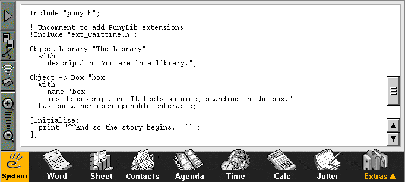
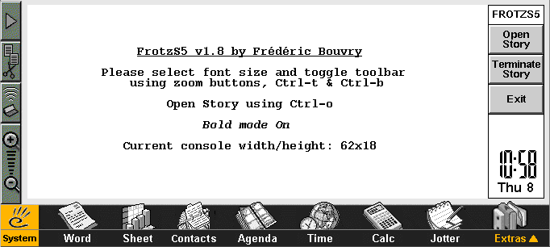
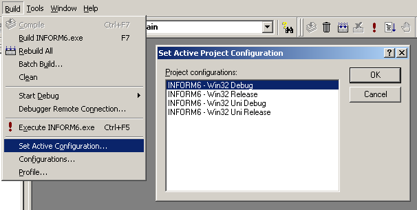

# Inform6 for EPOC32 #

Write (and play!) Interactive Fiction (a.k.a "text adventures") directly on your [Psion 5][Series5] Series / 5mx and other [EPOC32]-based devices!



This is an updated build (v6.35-dev) of [Inform6] for EPOC32 devices; I.e. Psion 5 Series, 5 mx, 5 mx Pro, Revo, Series 7, netBook & netPad and other licenced devices including Geofox One, Osaris, Diamond Mako and Ericsson MC218.

The [IF Archive] has a [build of v6.21](http://www.ifarchive.org/indexes/if-archiveXinfocomXcompilersXinform6Xexecutables.html
) from 1999 produced by Simon Quinn, but this was not up to date enough to work with [PunyInform], a library for producing text-adventures compact and lightweight enough to run on old hardware.

In this repo, I've done the absolutely bear minimum necessary to compile the unmodified Inform6 C code for EPOC32; all credit must go to Graham Nelson for the actual product.

The [PunyInform] library and sample files have been included, however the documentation has not due to file-size concerns; please refer to the [online documentation](https://github.com/johanberntsson/PunyInform/wiki/Manual).

[Inform6]: https://github.com/DavidKinder/Inform6
[EPOC32]: https://en.wikipedia.org/wiki/EPOC_(operating_system)
[Series5]: https://en.wikipedia.org/wiki/Psion_Series_5
[IF Archive]: http://www.ifarchive.org/
[PunyInform]: https://github.com/johanberntsson/PunyInform

## Installation ##

To run Inform6 on your device, first download a [release](https://github.com/Kroc/Informer/releases). Unzip the file and transfer the files inside to your device (i.e. Compact Flash card or using EPOC Connect).

"Inform6.exe" is the actual Inform compiler binary, but a number of tools are included to provide a complete environment for writing, compiling and playing interactive fiction on your EPOC32 device:

### inst_te.exe — ER3 Installer Support ###

On most ER3 (Series 5) devices the in-built installer is not provided and you won't be able to open "*.sis" files. In this case open "inst_te.exe"; nothing appears to happen, but this adds the SIS un/install functionality to the device (see the Control Panel for confirmation).

Once used, "inst_te.exe" can be deleted to save disk space.

### stdlib.sis — C Standard Library ###

Inform6 requires the C Standard Library to be installed on the device; this is provided as "stdlib.sis".

Once installed, "stdlib.sis" can be deleted to save disk space; it might be automatically deleted after installation, this is okay.

### editor/ — Plain Text Editor ###

Psion & EPOC32 devices do not come with a plain-text editor. Whilst you can import & export plain-text files from the native _Word_ application, this is hardly practical. For editing your Inform6 games on the device, installers for the "Symbian Text Editor Application" is provided in the "editor" folder.

The "editor" folder can be deleted after installation to save disk space.

### frotzs5/ — Frotz Z-Machine Interpreter ###

For _playing_ the games you write, and interactive fiction in general, an installer for "FrotzS5" is provided.

The "frotzs5" folder can be deleted after installation to save disk space.

## Workflow ##

Inform6 is not an all-in-one app like other EPOC32 apps (help wanted!), so you will need to use an edit->compile->test workflow.

Since you will be switching regularly between three different apps, I **strongly** recommend installing _FileSwitch_; a utility that let's you switch between open apps using <kbd>CTRL+SPC</kbd>. 

### 1. Edit: ###

You can write your story files on the device using Editor (mentioned in Installation above) or your plain-text editor of choice (for large games, you might want to try out DSTEdit which can manage multiple files at once).

_How_ to write story files is not covered here, you'll need to read the [Inform Designers Manual 4th Edition](https://www.inform-fiction.org/manual/download_dm4.html) which covers the Inform6 language and the [PunyInform manual](https://github.com/johanberntsson/PunyInform/wiki/manual) which covers adjustments required for the PunyInform library.

(There's nothing stopping you from using the [standard Inform6 library](https://ifarchive.org/indexes/if-archive/infocom/compilers/inform6/library/) but it will produce larger, slower-running binaries.)

### 2. Compile: ###

*Inform6 isn't an app with a GUI*, it's a command-line executable! You will need a shell to be able to invoke "inform6.exe" with the desired parameters. EPOC32 doesn't come with a command-line shell, but one is provided in the download for you ("shell.exe").

When you open "shell.exe", you will need to navigate to the location of "inform6.exe" (and your story file) using the command-line. Type `D:`, for example, to switch to the "D" drive (CompactFlash slot). Use `dir` to list directory contents, and `cd` to change directories.

Compile your story file by invoking "inform6", e.g.:

```
inform6 -x +lib mystory.inf
```

(`-x` is recommended to display progress and `+lib` includes the PunyInform library.)

This will create "mystory.z5" in the same directory, which you can open with _FrotzS5_ to play.

Full command-line parameters for Inform6 are described in "usage.txt".

**NOTE:** The Inform6 binary will *always* open a new console window (instead of re-using the Shell) and there's no way to pause or scroll the output. This is a limitation of the EPOC32 C Standard Library. I would like to resolve this but it requires tricky C / C++ interop that I don't have the knowledge for.

***If you have skills with interfacing C & C++, or Symbian programming experience in general, your help would greatly be appreciated; please contact me at <kroc@camendesign.com>.***

### 3. Test: ###

If there are no errors with the compilation, a "z5" (Z-machine) file will be produced using the source file name, i.e. "mystory.z5".

To play the game, open _FrotzS5_:

**NOTE:** You cannot open Z-machine files directly from the file-manager at the moment, an updated version of _FrotZ5_ with file-recognizer support is being worked on.



Tap "Open Story" and select the ".z5" file to begin playing.

Note that you must quit FrotzS5 or terminate the story (use the button, or type `quit`) before you can run the compiler again.


## Compiling Inform6 From Source ##

If you want to toy with the source code, you'll need to set up a period-accurate EPOC32 development environment; caveat emptor.

### Prerequisites: ###

You will need:

* A Windows NT4, 2000 or Windows XP PC or Virtual Machine (e.g. [VirtualBox]), with 256 MB or more RAM.
Windows 2000 is recommended -- it's stable and there's no online-activation. Compiling on modern OSes is neither supported or even likely to work

* Microsoft Visual C++ v5 or v6 (recommended). Only a minimal install is required. We will be using just `nmake` and the MSVC compiler

* The EPOC32 ER5 C++ SDK. Binaries produced will work on ER3/4 machines; the ER3 SDK is not supported. Apply the VC6 patch, provided in the SDK folder, if using Visual C++ 6

[VirtualBox]: https://www.virtualbox.org/

Where you place the Informer source code is very important:

* The SDK is required to be installed to the root of a partition; C: is fine if you don't have extra partitions. _The Informer source must be on the same partition as the SDK_.

* The SDK requires that all source code files are located _two directories deep,_ no less! That is, you *must* unzip the source code bundle so that the root of the SDK partition contains a folder named "informer" (this exact name is _required_, i.e. "C:\informer\\..."), which contains this read-me, the "inform6-src" folder and so on.

### Automated Build Scripts: ###

Two scripts are provided to automate the build for you:

1. "build_deb.bat" automates compiling a debug build and automatically starts the EPOC emulator.

    Note: Since Inform6 is a command-line executable, the default help will be printed and the program will exit, so this is only useful in testing that the program compiled successfully

2. "build_rel.bat" will build a release-ready version. The EPOC emulator is launched just to test that the release version still executes as expected. A release-ready ZIP-file is produced in the "release" folder

### Using The Visual C++ IDE: ###

To edit / compile from within Visual C++, run "makmake-vc5.bat" in the "group" folder. This will generate VC++5 project files (open "INFORM6.DSW"). If you have VC++6 then accept the prompt that asks you to upgrade the project when opened.

**WARNING:** As required by any VC++ project generated by Psion's `makmake` tool, the project's active configuration will be set to Unicode by default, which _won't_ compile! The first thing you should do after opening the project is go to the _Build > Set Active Configuration_ menu and select "Win32 Debug".

